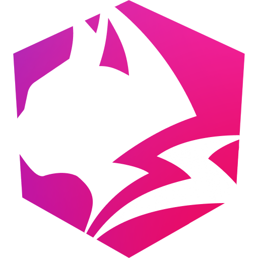
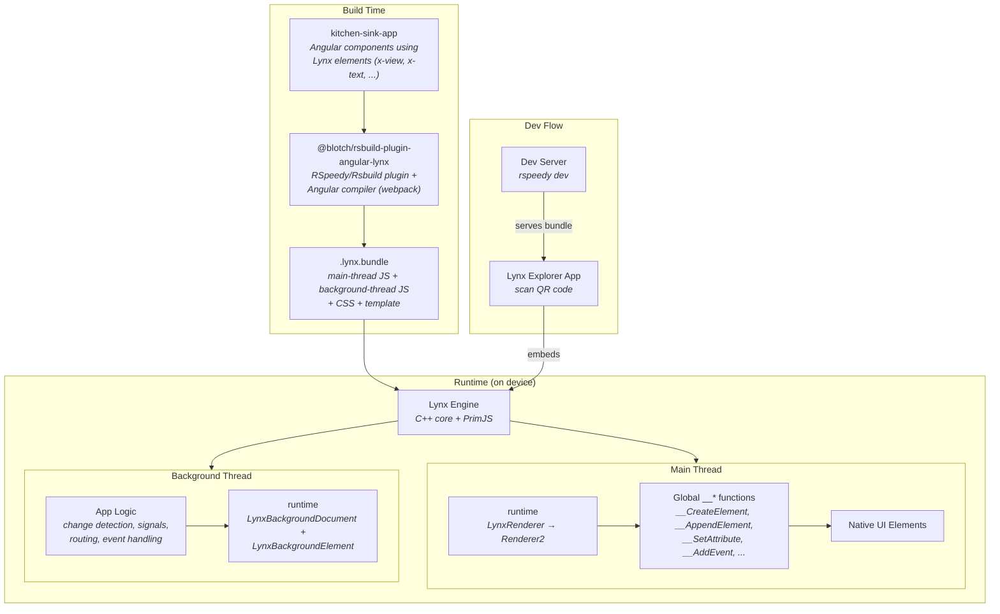

<p align="center">
  
</p>

<p align="center">
  <a href="https://www.npmjs.com/package/@blotch/angular-lynx"></a>
  <a href="https://www.npmjs.com/package/@blotch/angular-lynx"></a>
  <a href="https://github.com/Blotch-Smart-Frames/angular-lynx/blob/master/LICENSE"></a>
  <a href="https://github.com/Blotch-Smart-Frames/angular-lynx/actions"></a>
</p>

# AngularLynx

Build native mobile apps with Angular. AngularLynx renders Angular components to native iOS, Android, and Web UI via the [Lynx](https://lynxjs.org/) runtime by ByteDance.

## Quick Start

```bash
npm create angular-lynx my-app
```

Or add to an existing Angular project:

```bash
ng add @blotch/angular-lynx
```

Full documentation at [angularlynx.dev](https://angularlynx.dev).

## Packages

| Package | Description |
| --- | --- |
| [`@blotch/angular-lynx`](./packages/runtime) | Angular `Renderer2` bridging to Lynx's native element APIs |
| [`@blotch/rsbuild-plugin-angular-lynx`](./packages/rsbuild-plugin-angular-lynx) | Rsbuild plugin — Angular AOT compiler + Lynx dual-thread bundling |
| [`packages/kitchen-sink-app`](./packages/kitchen-sink-app) | Demo app with routing, signals, and Lynx native elements |

## Architecture

Monorepo split into build-time and runtime stages:



## Development

```bash
npm install && npm run build   # Build all packages
npm run demo                   # Start dev server (rspeedy)
```

Scan the QR code with [Lynx Explorer](https://lynxjs.org/guide/start/quick-start.html) to run on your phone.

## Credits

- [Angular](https://github.com/angular/angular)
- [Angular Rspack](https://github.com/nrwl/angular-rspack.git)
- [Lynx](https://github.com/lynx-family)
