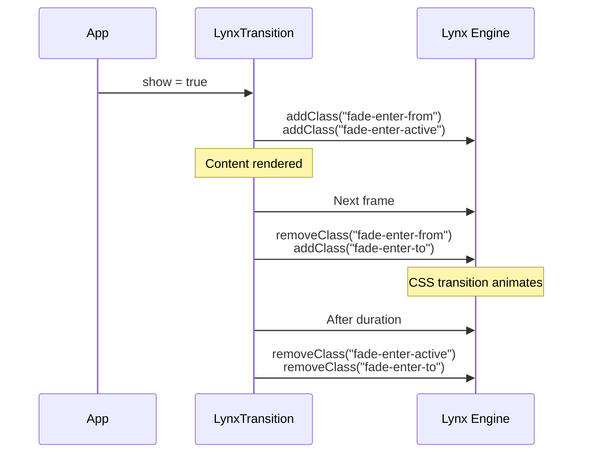

# Enter/Leave Transitions

The `LynxTransition` component animates content as it enters and leaves the screen. It manages CSS transition classes automatically, following the same convention as Vue's `<Transition>`.

## Basic Usage

Wrap your content in `<lynx-transition>` and control visibility with the `show` input:

```typescript title="src/app/fade-panel.component.ts"
import { Component, signal } from '@angular/core';
import { LYNX_ELEMENTS, LynxTransition } from '@blotch/angular-lynx'; // [!code highlight]

@Component({
  imports: [LYNX_ELEMENTS, LynxTransition], // [!code highlight]
  template: `
    <view (bindtap)="toggle()">
      <text>Toggle</text>
    </view>

    <lynx-transition [show]="visible()" name="fade" [duration]="300">
      <view class="panel">
        <text>Hello!</text>
      </view>
    </lynx-transition>
  `,
  styles: [
    `
      .fade-enter-active,
      .fade-leave-active {
        transition-property: opacity;
        transition-duration: 300ms;
      }
      .fade-enter-from,
      .fade-leave-to {
        opacity: 0;
      }
    `,
  ],
})
export class FadePanelComponent {
  readonly visible = signal(false);

  toggle() {
    this.visible.update((v) => !v);
  }
}
```

## How It Works

`LynxTransition` applies CSS classes to its host element in a specific sequence, giving the Lynx layout engine two frames to interpolate between the start and end state.

### Enter (show: false → true)



### Leave (show: true → false)

The same sequence in reverse. Content is removed from the tree **after** the animation completes, not immediately.

## Inputs

| Input      | Type      | Default | Description                                                   |
| ---------- | --------- | ------- | ------------------------------------------------------------- |
| `show`     | `boolean` | `false` | Controls visibility. Triggers enter/leave animation on change |
| `name`     | `string`  | `'v'`   | CSS class prefix (e.g. `"fade"` → `.fade-enter-from`)         |
| `duration` | `number`  | `300`   | Animation duration in milliseconds. Must match your CSS       |

## Outputs

| Output       | Type   | Description                         |
| ------------ | ------ | ----------------------------------- |
| `afterEnter` | `void` | Emits when the enter animation ends |
| `afterLeave` | `void` | Emits when the leave animation ends |

## CSS Classes

| Class                 | When applied                                  |
| --------------------- | --------------------------------------------- |
| `{name}-enter-from`   | Frame 1 of enter — the "start" state          |
| `{name}-enter-active` | Entire enter duration — set `transition` here |
| `{name}-enter-to`     | Frame 2 onward — the "end" state              |
| `{name}-leave-from`   | Frame 1 of leave — the "start" state          |
| `{name}-leave-active` | Entire leave duration — set `transition` here |
| `{name}-leave-to`     | Frame 2 onward — the "end" state              |

## Why `duration` Is Required

Lynx runs Angular on a background thread that cannot call `getComputedStyle()`. The component cannot auto-detect your CSS transition length, so you must pass it explicitly. This is the same constraint Vue Lynx has.

:::warning
Make sure your `duration` input matches the `transition-duration` in your CSS. If they differ, the classes will be removed before (or after) the visual transition finishes.
:::

## Slide Example

```typescript title="src/app/slide-panel.component.ts"
@Component({
  imports: [LYNX_ELEMENTS, LynxTransition],
  template: `
    <lynx-transition [show]="open()" name="slide" [duration]="200">
      <view class="drawer">
        <text>Drawer content</text>
      </view>
    </lynx-transition>
  `,
  styles: [
    `
      .slide-enter-active,
      .slide-leave-active {
        transition-property: transform;
        transition-duration: 200ms;
        transition-timing-function: ease-out;
      }
      .slide-enter-from,
      .slide-leave-to {
        transform: translateX(-100%);
      }
    `,
  ],
})
export class SlidePanelComponent {
  readonly open = signal(true);
}
```

## TransitionGroup (Lists)

`LynxTransitionGroup` animates items entering and leaving a list. Unlike `LynxTransition` (single element), it manages a collection and handles the diffing internally.

Since Angular's `@for` destroys views immediately on removal (no hook to delay), `LynxTransitionGroup` manages its own views via `ViewContainerRef`. You provide the list and an item template:

```typescript title="src/app/animated-list.component.ts"
import { Component, signal } from '@angular/core';
import { LYNX_ELEMENTS, LynxTransitionGroup } from '@blotch/angular-lynx'; // [!code highlight]

@Component({
  imports: [LYNX_ELEMENTS, LynxTransitionGroup], // [!code highlight]
  template: `
    <view (bindtap)="addItem()">
      <text>Add Item</text>
    </view>

    <lynx-transition-group
      [each]="items()"
      [trackBy]="byId"
      name="list"
      [duration]="300"
    >
      <ng-template let-item>
        <view (bindtap)="removeItem(item.id)">
          <text>{{ item.name }}</text>
        </view>
      </ng-template>
    </lynx-transition-group>
  `,
  styles: [
    `
      .list-enter-active,
      .list-leave-active {
        transition:
          opacity 300ms,
          transform 300ms;
      }
      .list-enter-from {
        opacity: 0;
        transform: translateX(30px);
      }
      .list-leave-to {
        opacity: 0;
        transform: translateX(-30px);
      }
    `,
  ],
})
export class AnimatedListComponent {
  private nextId = 0;
  readonly items = signal<{ id: number; name: string }[]>([]);

  readonly byId = (item: { id: number }) => item.id;

  addItem() {
    this.items.update((list) => [
      ...list,
      { id: this.nextId++, name: `Item ${this.nextId}` },
    ]);
  }

  removeItem(id: number) {
    this.items.update((list) => list.filter((item) => item.id !== id));
  }
}
```

### TransitionGroup Inputs

| Input      | Type                   | Default  | Description                                  |
| ---------- | ---------------------- | -------- | -------------------------------------------- |
| `each`     | `T[]`                  | `[]`     | The list of items to render                  |
| `trackBy`  | `(item: T) => unknown` | identity | Returns a unique key per item (like `track`) |
| `name`     | `string`               | `'v'`    | CSS class prefix                             |
| `duration` | `number`               | `300`    | Animation duration in milliseconds           |

### TransitionGroup Outputs

| Output       | Type | Description                                  |
| ------------ | ---- | -------------------------------------------- |
| `afterEnter` | `T`  | Emits the item when its enter animation ends |
| `afterLeave` | `T`  | Emits the item when its leave animation ends |

:::tip
Move animations (FLIP) are not supported — `getBoundingClientRect()` is unavailable from the background thread. This is the same limitation Vue Lynx has.
:::
