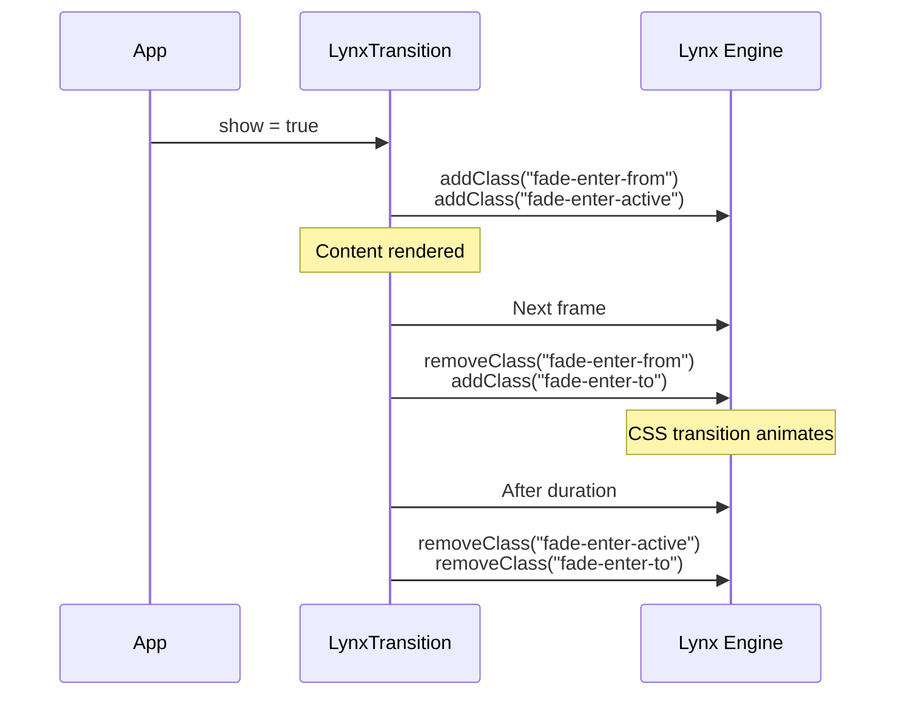

# Enter/Leave Transitions

The `LynxTransition` component animates content as it enters and leaves the screen. It manages CSS transition classes automatically, following the same convention as Vue's `<Transition>`.

## Basic Usage

Wrap your content in `<lynx-transition>` and control visibility with the `show` input:

```typescript title="src/app/fade-panel.component.ts"
import { Component, signal } from '@angular/core';
import { LYNX_ELEMENTS, LynxTransition } from '@blotch/angular-lynx'; // [!code highlight]

@Component({
  imports: [LYNX_ELEMENTS, LynxTransition], // [!code highlight]
  template: `
    <view (bindtap)="toggle()">
      <text>Toggle</text>
    </view>

    <lynx-transition [show]="visible()" name="fade" [duration]="300">
      <view class="panel">
        <text>Hello!</text>
      </view>
    </lynx-transition>
  `,
  styles: [`
    .fade-enter-active, .fade-leave-active {
      transition-property: opacity;
      transition-duration: 300ms;
    }
    .fade-enter-from, .fade-leave-to {
      opacity: 0;
    }
  `],
})
export class FadePanelComponent {
  readonly visible = signal(false);

  toggle() {
    this.visible.update((v) => !v);
  }
}
```

## How It Works

`LynxTransition` applies CSS classes to its host element in a specific sequence, giving the Lynx layout engine two frames to interpolate between the start and end state.

### Enter (show: false → true)



### Leave (show: true → false)

The same sequence in reverse. Content is removed from the tree **after** the animation completes, not immediately.

## Inputs

| Input      | Type      | Default | Description                                                   |
| ---------- | --------- | ------- | ------------------------------------------------------------- |
| `show`     | `boolean` | `false` | Controls visibility. Triggers enter/leave animation on change |
| `name`     | `string`  | `'v'`   | CSS class prefix (e.g. `"fade"` → `.fade-enter-from`)         |
| `duration` | `number`  | `300`   | Animation duration in milliseconds. Must match your CSS       |

## Outputs

| Output       | Type   | Description                           |
| ------------ | ------ | ------------------------------------- |
| `afterEnter` | `void` | Emits when the enter animation ends   |
| `afterLeave` | `void` | Emits when the leave animation ends   |

## CSS Classes

| Class                  | When applied                                     |
| ---------------------- | ------------------------------------------------ |
| `{name}-enter-from`    | Frame 1 of enter — the "start" state             |
| `{name}-enter-active`  | Entire enter duration — set `transition` here     |
| `{name}-enter-to`      | Frame 2 onward — the "end" state                 |
| `{name}-leave-from`    | Frame 1 of leave — the "start" state             |
| `{name}-leave-active`  | Entire leave duration — set `transition` here     |
| `{name}-leave-to`      | Frame 2 onward — the "end" state                 |

## Why `duration` Is Required

Lynx runs Angular on a background thread that cannot call `getComputedStyle()`. The component cannot auto-detect your CSS transition length, so you must pass it explicitly. This is the same constraint Vue Lynx has.

:::warning
Make sure your `duration` input matches the `transition-duration` in your CSS. If they differ, the classes will be removed before (or after) the visual transition finishes.
:::

## Slide Example

```typescript title="src/app/slide-panel.component.ts"
@Component({
  imports: [LYNX_ELEMENTS, LynxTransition],
  template: `
    <lynx-transition [show]="open()" name="slide" [duration]="200">
      <view class="drawer">
        <text>Drawer content</text>
      </view>
    </lynx-transition>
  `,
  styles: [`
    .slide-enter-active, .slide-leave-active {
      transition-property: transform;
      transition-duration: 200ms;
      transition-timing-function: ease-out;
    }
    .slide-enter-from, .slide-leave-to {
      transform: translateX(-100%);
    }
  `],
})
export class SlidePanelComponent {
  readonly open = signal(true);
}
```
