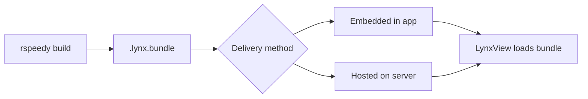

# Building for Production

This guide covers how to build your AngularLynx app into a production bundle and deploy it to a native mobile app.

## Build Command

Run the production build from your project root:

```bash
npx rspeedy build
```

This compiles your Angular components, templates, styles, and assets into optimized `.lynx.bundle` files in the `dist/` directory.

## Output Files

After building, your `dist/` directory looks like this:

```
dist/
├── main.lynx.bundle            # Your app's main bundle
├── async/
│   └── lazy-route.lynx.bundle  # Lazy-loaded route chunks
└── static/
    ├── image/
    │   └── logo.a1b2c3.png     # Hashed image assets
    ├── svg/
    │   └── icon.d4e5f6.svg
    └── font/
        └── custom.g7h8i9.woff2
```

| File | Purpose |
|------|---------|
| `main.lynx.bundle` | The primary bundle loaded when your app starts |
| `async/*.lynx.bundle` | Chunks for lazy-loaded routes (loaded on demand) |
| `static/` | Images, fonts, and other assets referenced in your code |

:::tip
Lazy-loaded routes (`loadComponent(() => import('./path'))`) are automatically split into separate async bundles. See [Routing](/guide/routing) for more on lazy loading.
:::

## How Deployment Works

Lynx apps don't run standalone — they run inside a **native host app** that embeds the Lynx engine. The host app creates a `LynxView` and loads your bundle into it. Your Angular code runs in the Lynx runtime and renders native UI elements.



There are two deployment strategies:

### Embedded Bundles

Ship bundle files as assets inside the native app binary. The host app loads them from the local filesystem.

**Pros:** No network dependency, instant load, works offline.
**Cons:** Requires an app store update to change content.

### Remote Bundles

Host bundle files on a CDN or web server. The host app fetches them over HTTP at runtime.

**Pros:** Update content without an app store release, A/B test different versions, reduce app binary size.
**Cons:** Requires network connectivity for first load, needs a caching strategy.

:::note
Setting up the native host app (adding the Lynx SDK, creating a `LynxView`, configuring bundle loading) is handled by the native team. See the official Lynx documentation:
- [Integrate with Existing Apps](https://lynxjs.org/guide/start/integrate-with-existing-apps.html) — Platform-specific setup for iOS, Android, and more
- [Embedding LynxView](https://lynxjs.org/guide/embed-lynx-to-native.html) — Configuring LynxView size and layout within native views
:::

## Over-the-Air Updates

Remote bundles enable updating your app without going through app store review. Deploy a new `.lynx.bundle` to your server, and users get the update next time the host app loads the bundle.

A typical setup:

1. Build your bundle with `npx rspeedy build`
2. Upload `dist/` contents to your CDN or static file server
3. The native host app fetches the latest bundle URL on launch
4. New content renders immediately — no app update required

:::tip
Combine embedded and remote strategies: ship a baseline bundle with the app for instant first launch, then check for updates from the server in the background.
:::

## Production Checklist

Before deploying, verify:

- **Error handling** — Confirm your [error handler](/guide/error-handling) is configured (remove any on-screen debug overlays)
- **Accessibility** — The [accessibility inspector](/guide/accessibility) is disabled by default in production builds
- **Bundle size** — Check `dist/` file sizes; lazy-load heavy routes to keep the main bundle small
- **Remote logging** — Set up [remote logging](/guide/remote-logging) so you can diagnose issues on-device
- **Host data** — Coordinate with the native team on [InitData](/guide/host-data/init-data) and [GlobalData](/guide/host-data/global-data) contracts
