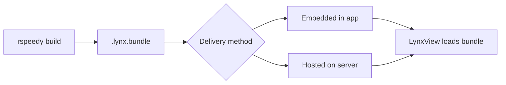

# Publishing your App

This guide covers how to build your AngularLynx app into a production bundle and deploy it to a native mobile app.

## Build Command

Run the production build from your project root:

```bash
npx rspeedy build
```

This compiles your Angular components, templates, styles, and assets into optimized `.lynx.bundle` files in the `dist/` directory.

## Output Files

After building, your `dist/` directory looks like this:

```
dist/
├── main.lynx.bundle            # Your app's main bundle
├── async/
│   └── lazy-route.lynx.bundle  # Lazy-loaded route chunks
└── static/
    ├── image/
    │   └── logo.a1b2c3.png     # Hashed image assets
    ├── svg/
    │   └── icon.d4e5f6.svg
    └── font/
        └── custom.g7h8i9.woff2
```

| File                  | Purpose                                                 |
| --------------------- | ------------------------------------------------------- |
| `main.lynx.bundle`    | The primary bundle loaded when your app starts          |
| `async/*.lynx.bundle` | Chunks for lazy-loaded routes (loaded on demand)        |
| `static/`             | Images, fonts, and other assets referenced in your code |

:::tip
Lazy-loaded routes (`loadComponent(() => import('./path'))`) are automatically split into separate async bundles. See [Routing](/guide/routing) for more on lazy loading.
:::

## Deployment

Lynx apps run inside a **native host app** that embeds the Lynx engine. You provide the `.lynx.bundle` files; the host app loads them into a `LynxView`.



### Embedded vs Remote Bundles

| Strategy                                          | Pros                                       | Cons                                        |
| ------------------------------------------------- | ------------------------------------------ | ------------------------------------------- |
| **Embedded** — ship bundles inside the app binary | Instant load, works offline                | Requires app store update to change content |
| **Remote** — host bundles on a CDN                | Update without app store release, A/B test | Needs network for first load                |

:::tip
Combine both: ship a baseline bundle with the app for instant first launch, then check for remote updates in the background.
:::

### Over-the-Air Updates

With remote bundles, deploy a new `.lynx.bundle` to your server and users get the update on next launch — no app store review needed.

:::note
Setting up the native host app (Lynx SDK, `LynxView`, bundle loading) is handled by the native team. See:

- [Integrate with Existing Apps](https://lynxjs.org/guide/start/integrate-with-existing-apps.html)
- [Embedding LynxView](https://lynxjs.org/guide/embed-lynx-to-native.html)

:::

## Production Checklist

Before deploying, verify:

- **Error handling** — Confirm your [error handler](/guide/error-handling) is configured (remove any on-screen debug overlays)
- **Accessibility** — The [accessibility inspector](/guide/accessibility) is disabled by default in production builds
- **Bundle size** — Check `dist/` file sizes; lazy-load heavy routes to keep the main bundle small
- **Remote logging** — Set up [remote logging](/guide/remote-logging) so you can diagnose issues on-device
- **Host data** — Coordinate with the native team on [InitData](/guide/host-data/init-data) and [GlobalData](/guide/host-data/global-data) contracts
