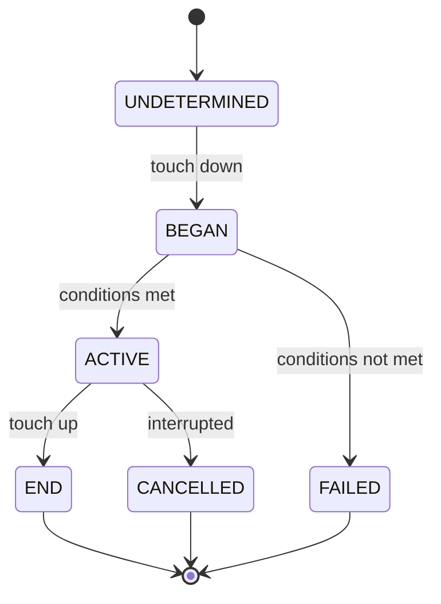

# Gestures

AngularLynx provides a declarative gesture system for handling touch interactions — tap, pan, fling, long press, pinch, and rotation. Gestures use a builder pattern for configuration and a directive for attachment to elements.

<Go example="gestures" defaultFile="src/app/app.component.ts" />

## Setup

Import `LynxGestureDetector` and the gesture classes you need:

```typescript title="src/app/my.component.ts"
import { Component, signal } from '@angular/core';
import {
  LynxGestureDetector, // [!code highlight]
  PanGesture, // [!code highlight]
  TapGesture, // [!code highlight]
  LYNX_ELEMENTS,
} from '@blotch/angular-lynx';

@Component({
  imports: [LYNX_ELEMENTS, LynxGestureDetector], // [!code highlight]
  template: `...`,
})
export class MyComponent {}
```

## Basic Usage

Create a gesture instance with the builder pattern, then attach it to an element via `[lynxGesture]`:

```typescript
export class MyComponent {
  readonly tapGesture = new TapGesture().onEnd((event) => {
    this.tapped.set(true);
  });

  readonly tapped = signal(false);
}
```

```angular-html
<view [lynxGesture]="tapGesture">
  <text>Tap me</text>
</view>
```

## Gesture Types

### TapGesture

Recognizes discrete tap gestures.

```typescript
const tap = new TapGesture()
  .numberOfTaps(2) // require double-tap
  .maxDuration(300) // max ms for the gesture
  .maxDistance(10) // max movement in px
  .onEnd((event) => {
    /* event.x, event.y */
  });
```

| Config            | Type     | Description                                      |
| ----------------- | -------- | ------------------------------------------------ |
| `numberOfTaps(n)` | `number` | Number of consecutive taps required (default: 1) |
| `maxDuration(ms)` | `number` | Maximum duration of the gesture in ms            |
| `maxDistance(px)` | `number` | Maximum finger movement allowed in px            |

**Event type:** `TapGestureEvent` — `{ x, y, state, absoluteX, absoluteY }`

### PanGesture

Recognizes continuous dragging gestures. Fires `onUpdate` on every frame while active.

```typescript
const pan = new PanGesture()
  .minDistance(10)
  .onUpdate((event) => {
    // event.translationX, event.translationY
  })
  .onEnd(() => {
    /* drag ended */
  });
```

| Config                  | Type                   | Description                             |
| ----------------------- | ---------------------- | --------------------------------------- |
| `minDistance(px)`       | `number`               | Minimum drag distance to activate       |
| `activeOffsetX(offset)` | `number \| [min, max]` | Horizontal offset threshold to activate |
| `activeOffsetY(offset)` | `number \| [min, max]` | Vertical offset threshold to activate   |
| `failOffsetX(offset)`   | `number \| [min, max]` | Horizontal offset that causes failure   |
| `failOffsetY(offset)`   | `number \| [min, max]` | Vertical offset that causes failure     |
| `minPointers(n)`        | `number`               | Minimum number of fingers required      |
| `maxPointers(n)`        | `number`               | Maximum number of fingers allowed       |

**Event type:** `PanGestureEvent` — `{ translationX, translationY, velocityX, velocityY, state, absoluteX, absoluteY }`

### FlingGesture

Recognizes quick swipe/fling gestures.

```typescript
import { FlingGesture, FlingDirection } from '@blotch/angular-lynx';

const fling = new FlingGesture()
  .direction(FlingDirection.LEFT | FlingDirection.RIGHT)
  .numberOfPointers(1)
  .onEnd((event) => {
    // event.velocityX, event.velocityY
  });
```

| Config                | Type             | Description                                        |
| --------------------- | ---------------- | -------------------------------------------------- |
| `direction(dir)`      | `FlingDirection` | Bitmask: `RIGHT(1)`, `LEFT(2)`, `UP(4)`, `DOWN(8)` |
| `numberOfPointers(n)` | `number`         | Number of fingers required                         |

**Event type:** `FlingGestureEvent` — `{ velocityX, velocityY, state, absoluteX, absoluteY }`

### LongPressGesture

Recognizes a press-and-hold gesture.

```typescript
const longPress = new LongPressGesture()
  .minDuration(500) // hold for 500ms
  .maxDistance(10) // max movement during hold
  .onStart(() => {
    /* held long enough — activated */
  })
  .onEnd(() => {
    /* finger lifted */
  });
```

| Config            | Type     | Description                         |
| ----------------- | -------- | ----------------------------------- |
| `minDuration(ms)` | `number` | Minimum hold time to activate       |
| `maxDistance(px)` | `number` | Maximum finger movement during hold |

**Event type:** `LongPressGestureEvent` — `{ x, y, duration, state, absoluteX, absoluteY }`

### PinchGesture

Recognizes two-finger pinch/zoom gestures.

```typescript
const pinch = new PinchGesture().onUpdate((event) => {
  // event.scale (1.0 = no change, >1 = zoom in, <1 = zoom out)
  // event.velocity
});
```

No configuration options. **Event type:** `PinchGestureEvent` — `{ scale, velocity, state, absoluteX, absoluteY }`

### RotationGesture

Recognizes two-finger rotation gestures.

```typescript
const rotation = new RotationGesture().onUpdate((event) => {
  // event.rotation (radians)
  // event.velocity
});
```

No configuration options. **Event type:** `RotationGestureEvent` — `{ rotation, velocity, state, absoluteX, absoluteY }`

## Gesture Lifecycle

Every gesture progresses through states:



### Callbacks

All gestures support these lifecycle callbacks:

| Callback            | When it fires                           |
| ------------------- | --------------------------------------- |
| `onBegin(cb)`       | Touch starts — gesture enters BEGAN     |
| `onStart(cb)`       | Gesture activates — enters ACTIVE       |
| `onEnd(cb)`         | Gesture finishes — enters END           |
| `onTouchesDown(cb)` | Additional fingers touch down           |
| `onTouchesUp(cb)`   | Fingers lift (but gesture may continue) |

Continuous gestures (Pan, Fling, Pinch, Rotation) also have:

| Callback       | When it fires                       |
| -------------- | ----------------------------------- |
| `onUpdate(cb)` | Every frame while gesture is ACTIVE |

All callbacks receive `(event, stateManager)` — the event with gesture-specific data, and a `GestureStateManager` for imperative control.

## GestureStateManager

The second argument to every callback lets you imperatively control gesture state:

```typescript
const pan = new PanGesture().onUpdate((event, state) => {
  if (Math.abs(event.translationX) > 200) {
    state.end(); // Force-end the gesture
  }
});
```

| Method               | Effect                                                         |
| -------------------- | -------------------------------------------------------------- |
| `activate()`         | Force the gesture into ACTIVE state                            |
| `fail()`             | Force the gesture into FAILED state                            |
| `end()`              | Force the gesture into END state                               |
| `consumeGesture()`   | Prevent this gesture event from propagating to parent elements |
| `interceptGesture()` | Prevent child elements from receiving gesture events           |

## Composition

When multiple gestures are attached to the same element, use composition helpers to control how they interact:

### Gesture.Exclusive

Gestures are tried in priority order. Each gesture waits for all predecessors to fail before it can activate. Use this when gestures overlap (e.g., pan vs tap on the same element):

```typescript
import { Gesture, PanGesture, TapGesture } from '@blotch/angular-lynx';

// Pan takes priority — tap only fires if the user didn't drag
readonly pan = new PanGesture().minDistance(10).onUpdate((e) => { ... });
readonly tap = new TapGesture().onEnd(() => { ... });
readonly gesture = Gesture.Exclusive(this.pan, this.tap); // [!code highlight]
```

```angular-html
<view [lynxGesture]="gesture">
  <text>Pan or tap</text>
</view>
```

### Gesture.Simultaneous

All gestures can recognize at the same time — none blocks the others:

```typescript
readonly pinch = new PinchGesture().onUpdate((e) => { ... });
readonly rotation = new RotationGesture().onUpdate((e) => { ... });
readonly gesture = Gesture.Simultaneous(this.pinch, this.rotation); // [!code highlight]
```

### Gesture.Race

First gesture to recognize wins — no explicit dependency relations:

```typescript
readonly swipeLeft = new FlingGesture().direction(FlingDirection.LEFT).onEnd(() => { ... });
readonly swipeRight = new FlingGesture().direction(FlingDirection.RIGHT).onEnd(() => { ... });
readonly gesture = Gesture.Race(this.swipeLeft, this.swipeRight); // [!code highlight]
```

## Multiple Gestures

You can also pass an array of gestures without composition — each operates independently:

```angular-html
<view [lynxGesture]="[tapGesture, doubleTapGesture]">
  <text>Tap or double-tap</text>
</view>
```

## Manual Relationships

For fine-grained control without composition helpers, use `waitFor`, `simultaneousWith`, and `continueWith` directly:

```typescript
readonly tap = new TapGesture().onEnd(() => { ... });
readonly doubleTap = new TapGesture()
  .numberOfTaps(2)
  .onEnd(() => { ... });

// Single tap waits for double-tap to fail before firing
readonly singleTap = this.tap.waitFor(this.doubleTap); // [!code highlight]
```

## Complete Example

```typescript title="src/app/gesture-demo.component.ts"
import { Component, signal } from '@angular/core';
import {
  Gesture,
  LynxGestureDetector,
  LongPressGesture,
  PanGesture,
  TapGesture,
  LYNX_ELEMENTS,
} from '@blotch/angular-lynx';

@Component({
  imports: [LYNX_ELEMENTS, LynxGestureDetector],
  template: `
    <view>
      <!-- Pan: drag and see translation -->
      <view
        [lynxGesture]="panGesture"
        style="width: 100px; height: 100px; background-color: #6200ee;"
      >
        <text style="color: white;">Drag me</text>
        <text style="color: white;">X: {{ panX() }} Y: {{ panY() }}</text>
      </view>

      <!-- Tap counter -->
      <view
        [lynxGesture]="tapGesture"
        style="padding: 16px; background-color: #03dac6; margin-top: 16px;"
      >
        <text>Taps: {{ tapCount() }}</text>
      </view>

      <!-- Exclusive: pan takes priority over tap -->
      <view
        [lynxGesture]="exclusive"
        style="padding: 16px; background-color: #ff9800; margin-top: 16px;"
      >
        <text>{{ action() }}</text>
      </view>
    </view>
  `,
})
export class GestureDemoComponent {
  readonly panX = signal(0);
  readonly panY = signal(0);
  readonly tapCount = signal(0);
  readonly action = signal('pan or tap');

  readonly panGesture = new PanGesture()
    .minDistance(5)
    .onUpdate((e) => {
      this.panX.set(Math.round(e.translationX));
      this.panY.set(Math.round(e.translationY));
    })
    .onEnd(() => {
      this.panX.set(0);
      this.panY.set(0);
    });

  readonly tapGesture = new TapGesture().onEnd(() =>
    this.tapCount.update((v) => v + 1),
  );

  // Exclusive composition: pan wins over tap
  readonly exclusivePan = new PanGesture()
    .minDistance(10)
    .onUpdate((e) => this.action.set(`pan x:${Math.round(e.translationX)}`))
    .onEnd(() => this.action.set('pan ended'));
  readonly exclusiveTap = new TapGesture().onEnd(() =>
    this.action.set('tap detected'),
  );
  readonly exclusive = Gesture.Exclusive(this.exclusivePan, this.exclusiveTap);
}
```

:::info
Gesture callbacks run on the background thread (where Angular executes). Signal updates inside callbacks trigger change detection automatically — no `setTimeout` needed for simple state updates.
:::
