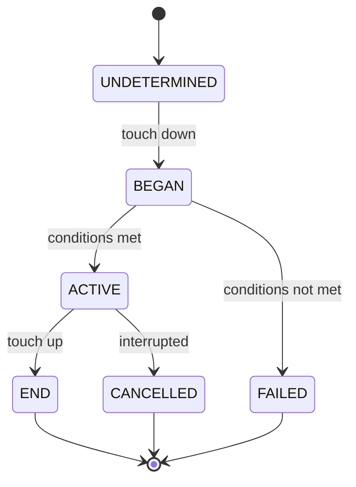

# Gesture Lifecycle

Every gesture progresses through states:



## Callbacks

All gestures support these lifecycle callbacks:

| Callback            | When it fires                           |
| ------------------- | --------------------------------------- |
| `onBegin(cb)`       | Touch starts — gesture enters BEGAN     |
| `onStart(cb)`       | Gesture activates — enters ACTIVE       |
| `onEnd(cb)`         | Gesture finishes — enters END           |
| `onTouchesDown(cb)` | Additional fingers touch down           |
| `onTouchesUp(cb)`   | Fingers lift (but gesture may continue) |

Continuous gestures (Pan, Fling, Pinch, Rotation) also have:

| Callback       | When it fires                       |
| -------------- | ----------------------------------- |
| `onUpdate(cb)` | Every frame while gesture is ACTIVE |

All callbacks receive `(event, stateManager)` — the event with gesture-specific data, and a `GestureStateManager` for imperative control.

## GestureStateManager

The second argument to every callback lets you imperatively control gesture state:

```typescript
const pan = new PanGesture().onUpdate((event, state) => {
  if (Math.abs(event.translationX) > 200) {
    state.end(); // Force-end the gesture
  }
});
```

| Method               | Effect                                                         |
| -------------------- | -------------------------------------------------------------- |
| `activate()`         | Force the gesture into ACTIVE state                            |
| `fail()`             | Force the gesture into FAILED state                            |
| `end()`              | Force the gesture into END state                               |
| `consumeGesture()`   | Prevent this gesture event from propagating to parent elements |
| `interceptGesture()` | Prevent child elements from receiving gesture events           |
