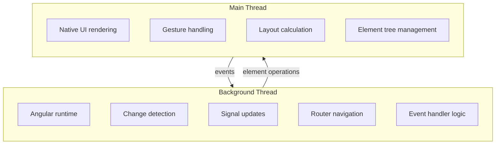

# What is AngularLynx?

AngularLynx is an Angular renderer for [Lynx](https://lynxjs.org/), the cross-platform native UI framework by ByteDance. It lets you write Angular components with the APIs you already know — standalone components, signals, `@if`/`@for` control flow, dependency injection — and render them to native mobile UI via the Lynx engine.

If you know Angular and are familiar with Lynx, you already know how to use AngularLynx.

## Features

- **Familiar Angular API** — Standalone components, signals, `@if`/`@for`/`@switch`, dependency injection, pipes, and more
- **Cross-platform native rendering** — iOS, Android, and Web via the Lynx rendering engine
- **Zoneless change detection** — Uses `provideZonelessChangeDetection()` with signals as the primary reactivity model
- **Full Angular Router** — In-memory routing adapted for Lynx's native runtime
- **Tailwind CSS** — Utility-first styling via `@lynx-js/tailwind-preset`
- **Testing utilities** — `@blotch/angular-lynx-testing-library` bootstraps the full Lynx pipeline in jsdom with `@testing-library/dom` queries, `fireEvent`, and snapshot support

## Try It

A simple counter built with Angular signals and Lynx elements:

<Go example="hello-world" defaultFile="src/app/app.component.ts" />

## For Angular Web Developers

If you've built Angular apps for the web, most of your knowledge transfers directly. Here are the key differences:

### Different bootstrap

```typescript
// Web Angular
import { bootstrapApplication } from '@angular/platform-browser';
bootstrapApplication(AppComponent, appConfig);

// AngularLynx
import { bootstrapApplication } from '@blotch/angular-lynx'; // [!code highlight]
bootstrapApplication(AppComponent, appConfig); // [!code highlight]
```

### Different elements

Lynx provides native UI elements instead of HTML. Your templates use `<view>`, `<text>`, and `<image>` instead of `<div>`, `<span>`, and ``:

```angular-html
<!-- Web Angular -->
<div class="card">
  <span>{{ message() }}</span>
  
</div>

<!-- AngularLynx -->
<view class="card">
  // [!code highlight] <text>{{ message() }}</text> // [!code highlight]
  <image [src]="logo" /> // [!code highlight]
</view>
// [!code highlight]
```

:::info
Text content must always be wrapped in `<text>`. Lynx does not support bare text nodes inside `<view>` — unlike HTML where text can appear anywhere.
:::

### Different events

Lynx uses its own event system with `bind` and `catch` prefixes instead of standard DOM events:

```angular-html
<!-- Web Angular -->
<button (click)="handleClick()">Click me</button>

<!-- AngularLynx -->
<view (bindtap)="handleTap()">
  // [!code highlight]
  <text>Tap me</text>
</view>
```

- `(bindtap)` — Handles tap events (bubbles up to parents)
- `(catchtap)` — Handles tap events and stops propagation

### No `document` or `window`

Lynx is a native runtime, not a browser. There is no `document`, `window`, or DOM API. Libraries that depend on browser APIs will not work without adaptation. Lynx provides its own runtime globals via the `lynx` object.

## The Dual-Thread Model

Lynx uses a dual-thread architecture that separates concerns between two execution contexts:



- **Background thread** — Where Angular runs. Your components, change detection, signals, and event handler logic all execute here.
- **Main thread** — Where native UI lives. Element creation, layout, and rendering happen here. Events originate from the main thread and are dispatched to the background thread.

At the end of each change detection cycle, all pending element operations are committed atomically to the native UI via `__FlushElementTree()`. This batched approach means changes appear on screen as a single, consistent update rather than incrementally.

:::tip
This model is similar to how React Native works — JavaScript runs on a separate thread from the native UI. The key difference is that Lynx's background thread handles layout calculation, not just JS execution.
:::

## Ecosystem

AngularLynx is part of a family of framework renderers for the Lynx platform:

| Framework   | Package                                                             | Status               |
| ----------- | ------------------------------------------------------------------- | -------------------- |
| React       | [`@lynx-js/react`](https://github.com/nichenqin/lynx-stack)         | Production-ready     |
| Vue         | [`vue-lynx`](https://nichenqin.github.io/vue-lynx)                  | Production-ready     |
| **Angular** | [`@blotch/angular-lynx`](https://github.com/nichenqin/angular-lynx) | **Work in progress** |

:::warning Work in Progress
AngularLynx is an early proof of concept. It supports the core Angular APIs needed to build real applications — standalone components, signals, routing, control flow, dependency injection — but some features are not yet implemented. API surfaces may change as the project matures.
:::

## Next Steps

- [Quick Start](/guide/quick-start) — Set up your first AngularLynx project
- [Lynx Elements](/guide/elements/) — Learn about native UI elements
- [Renderer Architecture](/guide/renderer-architecture) — Understand how Angular connects to Lynx
