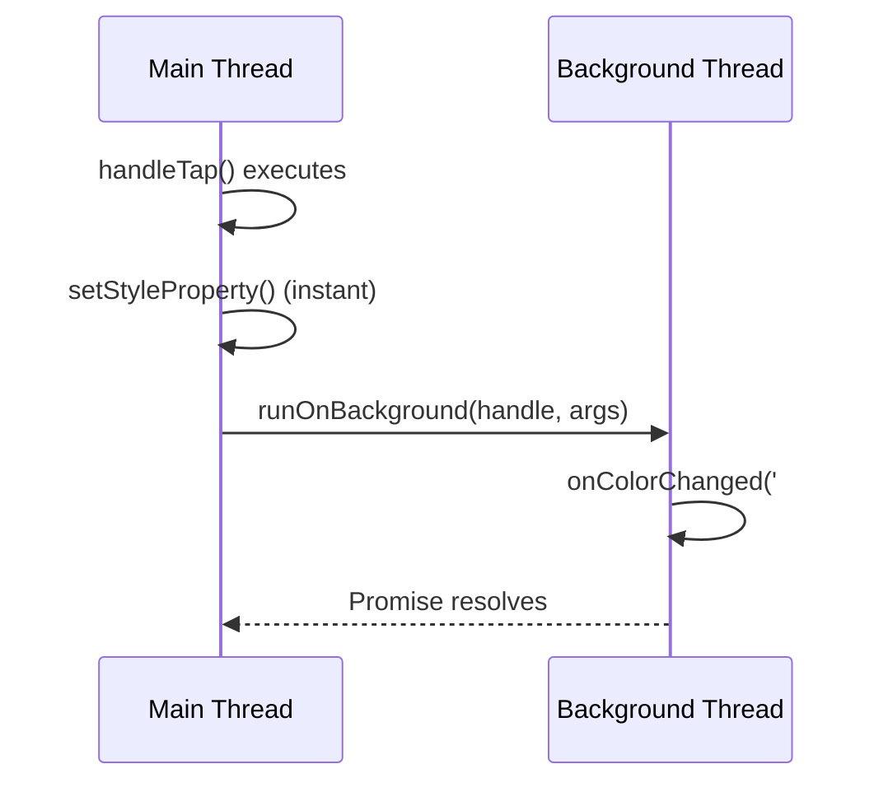

# `backgroundFn` and `runOnBackground`

Main thread functions can call back to the background thread using `runOnBackground`. This is useful when a main-thread event handler needs to trigger state updates, service calls, or other Angular-side logic.

:::danger Escape Hatch — Not Standard Angular
Main thread scripts directly manipulate native elements, **bypassing Angular's signal-based change detection entirely**. This is analogous to direct DOM manipulation via `ElementRef.nativeElement` — something Angular [explicitly discourages](https://angular.dev/api/core/ElementRef). Only use when cross-thread latency is unacceptable (e.g., 60fps gesture tracking). Try standard Angular event bindings first.
:::

## Setup

Define a background function at module scope with `backgroundFn()`. Like `mainThreadFn`, it uses a deterministic counter so both thread bundles generate matching IDs.

```typescript title="src/app/my.ts"
import {
  mainThreadFn,
  backgroundFn, // [!code highlight]
} from '@blotch/angular-lynx';
import type { MainThread } from '@blotch/angular-lynx';

// Registers on the background thread — can access module-level state
let lastColor = '';
const onColorChanged = backgroundFn((color: string) => {
  // [!code highlight]
  lastColor = color;
  // Could dispatch events, call services, update shared state, etc.
});

const handleTap = mainThreadFn((event: MainThread.TouchEvent) => {
  event.currentTarget.setStyleProperty('background-color', '#ff5722');
  // runOnBackground is a global injected into mainThreadFn — no import needed
  runOnBackground(onColorChanged, '#ff5722'); // [!code highlight]
});
```

## How It Works



## Rules

1. **Module-level only** — `backgroundFn` must be called at module scope, same as `mainThreadFn`.
2. **Closure over module state** — unlike `mainThreadFn`, background functions CAN reference module-level variables because they execute in the background thread context where the module lives.
3. **No component-level closures** — background functions can't capture `this`, signals, or injected services from a component instance. Use shared module-level state or event patterns instead.
4. **Arguments must be JSON-serializable** — data crosses the thread boundary via `JSON.stringify`.
5. **Returns a Promise** — `runOnBackground()` returns a `Promise` that resolves when the function completes.

## API

```typescript
// Define a background-callable function
backgroundFn<TArgs, TReturn>(fn: (...args: TArgs) => TReturn): BackgroundFnHandle<TArgs, TReturn>

// Call from main-thread code (available as a global in mainThreadFn functions)
runOnBackground(handle: BackgroundFnHandle, ...args: unknown[]): Promise<unknown>
```
