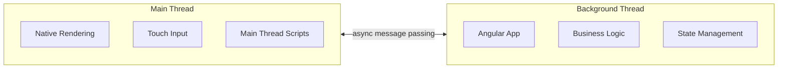

# Main Thread Scripts

AngularLynx lets you run JavaScript directly on the **main thread** — the same thread that handles native rendering and touch input. This eliminates the cross-thread round trip that normally occurs when event handlers run on the background thread, enabling instant UI responses to user interactions.

:::danger Escape Hatch — Not Standard Angular
Main thread scripts directly manipulate native elements, **bypassing Angular's signal-based change detection entirely**. This is analogous to using `ElementRef.nativeElement` for direct DOM manipulation on the web — something Angular's own documentation [explicitly discourages](https://angular.dev/api/core/ElementRef): _"Use this API as the last resort when direct access to DOM is needed. Use templating and data-binding provided by Angular instead."_

**Only use main thread scripts when the cross-thread round trip creates perceptible latency** — typically gesture-tracking animations that must run at 60fps. For simple tap handlers, state updates, or any logic that can tolerate a frame or two of delay, use standard Angular event bindings (`(bindtap)`, `(bindscroll)`, etc.) and let Angular's change detection handle the UI update.

Try the standard background-thread approach first. Only reach for main thread scripts when you've measured and confirmed the latency is unacceptable for your use case.
:::

<Go example="main-thread" defaultFile="src/app/app.component.ts" />

## Overview

Lynx uses a dual-thread architecture:



| Thread         | Responsibilities                                 | Latency                                |
| -------------- | ------------------------------------------------ | -------------------------------------- |
| **Main**       | Native rendering, touch/gesture dispatch, layout | Instant — same thread as the UI        |
| **Background** | Angular components, signals, routing, HTTP       | Round trip — serialized across threads |

Main thread scripts are ideal for:

- **Touch-driven visual feedback** (color changes, opacity, transforms on drag)
- **Gesture-based animations** that must track finger position at 60fps
- **Direct element manipulation** without waiting for the background thread

## Main Thread vs Background Thread

|                 | Main Thread                                           | Background Thread                            |
| --------------- | ----------------------------------------------------- | -------------------------------------------- |
| **Access to**   | Native elements, touch events, layout info            | Angular state, signals, services, DI         |
| **Latency**     | Zero — same thread as rendering                       | Round trip — serialized message passing      |
| **Best for**    | Visual feedback, animations, direct manipulation      | Business logic, state management, routing    |
| **Limitations** | No Angular DI, no signals, no closures over app state | Delayed UI updates, no direct element access |

:::tip
Use main thread scripts for **visual feedback** that must feel instant (color, opacity, transforms). Keep **business logic** (state updates, navigation, HTTP) on the background thread where Angular's full DI and reactivity system is available.
:::

:::warning
Main thread functions cannot capture closures over component state. They can only access their arguments, `MainThreadRef` values, and the global `lynx` API. If you need to communicate results back to Angular, use `LynxMainThreadService.runOnMainThread()` which returns a `Promise`.
:::

## Complete Example

```typescript title="src/app/main-thread-demo.component.ts"
import { Component, signal } from '@angular/core';
import {
  LYNX_ELEMENTS,
  LynxMainThreadEvent,
  mainThreadFn,
  createMainThreadRef,
} from '@blotch/angular-lynx';
import type { MainThread } from '@blotch/angular-lynx';

// Shared state across main thread calls
const tapCount = createMainThreadRef(0);

// Changes color instantly on tap — no cross-thread round trip
const handleTap = mainThreadFn((event: MainThread.TouchEvent) => {
  const el = event.currentTarget;
  tapCount.current++;

  const colors = ['#6200ee', '#03dac6', '#ff5722', '#4caf50', '#ff9800'];
  const color = colors[tapCount.current % colors.length]!;
  el.setStyleProperty('background-color', color);
});

// Tracks finger position and adjusts opacity in real time
const handleTouchMove = mainThreadFn((event: MainThread.TouchEvent) => {
  const el = event.currentTarget;
  const rect = el.getBoundingClientRect();
  const relativeX = (event.touches[0]!.clientX - rect.left) / rect.width;
  const opacity = Math.max(0.3, Math.min(1, relativeX));
  el.setStyleProperty('opacity', String(opacity));
});

const handleTouchEnd = mainThreadFn((event: MainThread.TouchEvent) => {
  event.currentTarget.setStyleProperty('opacity', '1');
});

@Component({
  imports: [LYNX_ELEMENTS, LynxMainThreadEvent],
  template: `
    <view>
      <!-- Main thread: instant color change -->
      <view
        [mainThreadBindtap]="handleTap"
        style="height: 100px; background-color: #6200ee; border-radius: 12px;
               justify-content: center; align-items: center;"
      >
        <text style="color: white; font-size: 18px;">Tap to change color</text>
      </view>

      <!-- Main thread: real-time opacity tracking -->
      <view
        [mainThreadBindtouchmove]="handleTouchMove"
        [mainThreadBindtouchend]="handleTouchEnd"
        style="height: 100px; background-color: #1976d2; border-radius: 12px;
               margin-top: 16px; justify-content: center; align-items: center;"
      >
        <text style="color: white; font-size: 18px;"
          >Drag to change opacity</text
        >
      </view>

      <!-- Background thread comparison -->
      <view
        (bindtap)="onBgTap()"
        style="height: 80px; background-color: #757575; border-radius: 12px;
               margin-top: 16px; justify-content: center; align-items: center;"
      >
        <text style="color: white;">BG taps: {{ bgTapCount() }}</text>
      </view>
    </view>
  `,
})
export class MainThreadDemoComponent {
  readonly handleTap = handleTap;
  readonly handleTouchMove = handleTouchMove;
  readonly handleTouchEnd = handleTouchEnd;
  readonly bgTapCount = signal(0);

  onBgTap(): void {
    this.bgTapCount.update((v) => v + 1);
  }
}
```
