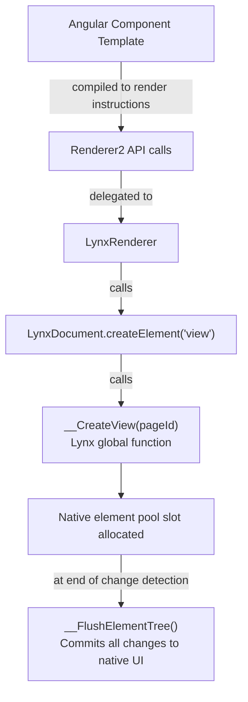

# Renderer Architecture

Angular uses `Renderer2` as its abstraction for DOM manipulation. On the web, this maps to `document.createElement()`, `element.appendChild()`, and friends. In Angular Lynx, the renderer maps these operations to Lynx's native element API — global functions like `__CreateView`, `__AppendElement`, and `__FlushElementTree`.

Understanding this architecture helps you debug rendering issues and reason about platform constraints.

## The Rendering Pipeline

When Angular renders a component template, the operations flow through several layers:



Each step in this pipeline is a direct function call — there is no virtual DOM diffing or reconciliation. Angular's compiled template instructions directly create and manipulate native Lynx elements.

## Key Components

### LynxRendererFactory2

Implements Angular's `RendererFactory2`. When Angular creates a component, it calls `createRenderer()` to get a renderer instance. The factory returns:

- **`LynxRenderer`** — For components with `ViewEncapsulation.None`
- **`EmulatedLynxRenderer`** — For the default `ViewEncapsulation.Emulated`, which adds a scope class to the host element for CSS isolation

The factory also implements `end()`, which is called after every change detection cycle. This is where `__FlushElementTree()` is invoked to commit all pending element operations to the native UI.

### LynxRenderer

Implements Angular's `Renderer2` interface. Maps every DOM operation to its Lynx equivalent:

| Renderer2 method | Lynx global function |
|---|---|
| `createElement('view')` | `__CreateView(pageId)` |
| `createElement('text')` | `__CreateText(pageId)` |
| `createElement('image')` | `__CreateImage(pageId)` |
| `appendChild(parent, child)` | `__AppendElement(parent, child)` |
| `insertBefore(parent, child, ref)` | `__InsertElementBefore(parent, child, ref)` |
| `removeChild(parent, child)` | `__RemoveElement(child)` |
| `setAttribute(el, name, value)` | `__SetAttribute(el, name, value)` |
| `setStyle(el, style, value)` | `__AddInlineStyle(el, style, value)` |
| `addClass(el, name)` | `__AddClass(el, name)` |
| `listen(el, event, callback)` | `__AddEvent(el, eventType, event)` |
| `createComment()` | `__CreateView(pageId)` (invisible anchor) |

:::info
Angular uses comment nodes as insertion anchors for structural directives (`@if`, `@for`, `ViewContainerRef`). Since Lynx has no comment elements, Angular Lynx creates invisible `<view>` elements as anchors instead.
:::

### LynxDocument

The main-thread document implementation. Creates native elements using Lynx's global `__Create*` functions. Each element type has a dedicated creation function:

- `__CreateView`, `__CreateText`, `__CreateImage`
- `__CreateScrollView`, `__CreateList`
- `__CreateFrame`, `__CreateBlock`
- and others for each supported element

### LynxBackgroundDocument

The background-thread document implementation. Creates an in-memory virtual element tree — no native calls are made. This is used when Angular runs on the background thread for layout calculation.

## The Dual-Thread Architecture

The build plugin (`@blotch/rsbuild-plugin-angular-lynx`) compiles your app into two separate bundles from the same source code:

| Bundle | Thread | Compile-time define | Document used |
|---|---|---|---|
| `main-thread.js` | Main | `__MAIN_THREAD__ = true` | `LynxDocument` (real native calls) |
| `background-thread.js` | Background | `__MAIN_THREAD__ = false` | `LynxBackgroundDocument` (in-memory) |

The `provideLynxRenderer()` function checks `__MAIN_THREAD__` at runtime to decide which document to instantiate:

```typescript
{
  provide: LYNX_DOCUMENT,
  useFactory: () => {
    if (__MAIN_THREAD__) {
      return new LynxDocument();        // Real native element creation
    }
    return new LynxBackgroundDocument(); // Virtual in-memory tree
  },
}
```

## The Element Flush Cycle

Unlike the web DOM where changes apply immediately to the screen, Lynx batches all element operations and applies them atomically:

1. An event fires (e.g., user taps a button)
2. Angular runs your event handler, which updates signals
3. Change detection runs — `LynxRenderer` calls `__CreateView`, `__AppendElement`, `__SetAttribute`, etc.
4. All these operations are queued internally by Lynx
5. `LynxRendererFactory2.end()` calls `__FlushElementTree()`
6. Lynx applies all queued operations to the native UI in one atomic update

:::tip
This batching means you never see partial UI states. If your event handler adds 10 elements and updates 5 styles, they all appear on screen simultaneously after the flush. This is similar to React's batched state updates, but at the rendering engine level.
:::

## How This Differs from Web Angular

| Concept | Web Angular | Angular Lynx |
|---|---|---|
| Underlying API | Browser DOM | Lynx global `__*` functions |
| Change visibility | Immediate (paint on next frame) | Batched (flush at end of CD cycle) |
| Thread model | Single main thread | Dual: Angular on background, UI on main |
| Element types | HTML elements (unlimited) | Lynx native elements (fixed pool ~256 slots) |
| CSS model | Full browser CSS | Lynx CSS subset (no inheritance, no flow layout) |
| Comment nodes | Native HTML comments | Invisible `<view>` anchors |

## The Element Pool

Lynx allocates elements in a fixed-size native pool (approximately 256 slots on device). Important implications:

- **`__RemoveElement` detaches but does not free slots** — removed elements still occupy pool space
- **Exhausting the pool crashes the app** — creating too many elements without reuse causes a hard crash
- **Route reuse is critical** — `LynxRouteReuseStrategy` detaches views instead of destroying them, so their pool slots are reclaimed on revisit

This is why Angular Lynx's router uses a custom `RouteReuseStrategy` by default. See [Routing](/guide/routing) for details.
