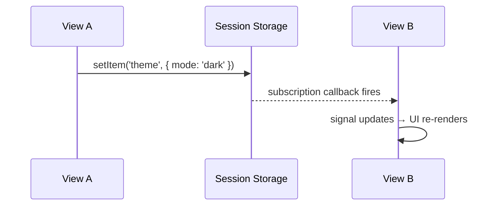

# Session Storage

<Go example="session-storage" defaultFile="src/app/app.component.ts" />

Lynx session storage is a cross-LynxView key-value store that persists for the lifetime of the host app session. Use it to share data between multiple cards, pages, or LynxView instances. AngularLynx wraps the native API with `LynxSessionStorageService` — an injectable service providing Promise-based reads, direct writes, and reactive signals.

## Overview

Unlike browser `localStorage`, Lynx session storage:

- Stores **objects** (not strings) — no JSON serialization needed
- Reads are **asynchronous** (callback-based natively, Promise-based in AngularLynx)
- Supports **subscriptions** — get notified when another LynxView changes a key
- Scoped to the **host app session** — cleared when the app process dies

| Method        | Description                                           |
| ------------- | ----------------------------------------------------- |
| `setItem`     | Write a value (synchronous, fire-and-forget)          |
| `getItem`     | One-shot async read (returns a `Promise`)             |
| `subscribe`   | Listen for changes from other LynxViews               |
| `unsubscribe` | Cancel a subscription                                 |
| `watch`       | Create a reactive signal that auto-updates on changes |

## Setup

No extra providers needed — `LynxSessionStorageService` is `providedIn: 'root'`:

```typescript title="src/app/my.component.ts"
import { Component, inject } from '@angular/core';
import { LynxSessionStorageService, LYNX_ELEMENTS } from '@blotch/angular-lynx'; // [!code highlight]

@Component({
  imports: [LYNX_ELEMENTS],
  template: `...`,
})
export class MyComponent {
  readonly #sessionStorage = inject(LynxSessionStorageService); // [!code highlight]
}
```

## Writing Data

`setItem` writes a value to session storage. All subscribers (including those in other LynxViews) are notified immediately.

```typescript
const sessionStorage = inject(LynxSessionStorageService);

sessionStorage.setItem('user-preferences', { theme: 'dark', fontSize: 16 });
sessionStorage.setItem('counter', 42);
```

Values can be any serializable object — numbers, strings, arrays, or nested objects.

## Reading Data

### One-Shot Read

`getItem` performs a single asynchronous read:

```typescript
const prefs = await sessionStorage.getItem<{ theme: string }>(
  'user-preferences',
);
console.log(prefs.theme); // 'dark'
```

### Reactive Signal

`watch` creates an Angular signal that automatically stays in sync with the session storage key. When any LynxView writes to that key, the signal updates:

```typescript title="src/app/counter.component.ts"
import { Component, inject } from '@angular/core';
import { LynxSessionStorageService, LYNX_ELEMENTS } from '@blotch/angular-lynx';

@Component({
  imports: [LYNX_ELEMENTS],
  template: `
    <view>
      <text>Counter: {{ counter() ?? 'not set' }}</text>
    </view>
  `,
})
export class CounterComponent {
  readonly #sessionStorage = inject(LynxSessionStorageService);

  // Auto-updates when any LynxView calls setItem('counter', ...)
  readonly counter = this.#sessionStorage.watch<number>('counter'); // [!code highlight]
}
```

The signal starts as `undefined` and seeds itself with the current value asynchronously. The subscription is automatically cleaned up when the component is destroyed.

#### Providing an explicit injector

If you call `watch` outside an injection context (e.g., inside a callback), pass an injector explicitly:

```typescript
import { inject, Injector } from '@angular/core';

const injector = inject(Injector);

someCallback(() => {
  const value = sessionStorage.watch('key', { injector });
});
```

## Manual Subscriptions

For fine-grained control, use `subscribe` and `unsubscribe` directly:

```typescript
const sub = sessionStorage.subscribe<number>('counter', (value) => {
  console.log('Counter changed to:', value);
});

// Later: clean up
sessionStorage.unsubscribe(sub);
```

:::tip
Prefer `watch()` over manual subscriptions — it handles cleanup automatically via `DestroyRef` and integrates with Angular's signal-based change detection.
:::

## Cross-View Communication

Session storage is designed for sharing state between multiple LynxViews. A typical pattern:



**View A** writes:

```typescript
sessionStorage.setItem('theme', { mode: 'dark' });
```

**View B** reacts:

```typescript
readonly theme = this.#sessionStorage.watch<{ mode: string }>('theme');
// template: {{ theme()?.mode }} → automatically shows 'dark'
```

## Complete Example

```typescript title="src/app/session-storage-demo.component.ts"
import { Component, inject, signal } from '@angular/core';
import { LYNX_ELEMENTS, LynxSessionStorageService } from '@blotch/angular-lynx';

@Component({
  imports: [LYNX_ELEMENTS],
  template: `
    <view>
      <!-- Reactive counter via watch() -->
      <view style="padding: 16px;">
        <text>Counter: {{ counter() ?? 'undefined' }}</text>
        <view (bindtap)="increment()">
          <text>Increment</text>
        </view>
        <view (bindtap)="reset()">
          <text>Reset</text>
        </view>
      </view>

      <!-- One-shot read via getItem() -->
      <view style="padding: 16px;">
        <text>Last read: {{ lastRead() }}</text>
        <view (bindtap)="readOnce()">
          <text>Read Once</text>
        </view>
      </view>
    </view>
  `,
})
export class SessionStorageDemoComponent {
  readonly #sessionStorage = inject(LynxSessionStorageService);

  readonly counter = this.#sessionStorage.watch<number>('counter');
  readonly lastRead = signal<string>('(not yet read)');

  increment(): void {
    const current = this.counter() ?? 0;
    this.#sessionStorage.setItem('counter', current + 1);
  }

  reset(): void {
    this.#sessionStorage.setItem('counter', 0);
  }

  async readOnce(): Promise<void> {
    try {
      const value = await this.#sessionStorage.getItem<number>('counter');
      this.lastRead.set(`counter = ${value ?? 'undefined'}`);
    } catch {
      this.lastRead.set('(not available)');
    }
  }
}
```

:::info
`LynxSessionStorageService` is safe to inject in any environment. When the native Lynx session storage API is not available (e.g., during unit tests, SSR, or web preview), the service falls back to an in-memory store. All methods — `setItem`, `getItem`, `watch`, and `subscribe` — work correctly, though data will not persist across page reloads or be shared across LynxViews.
:::
